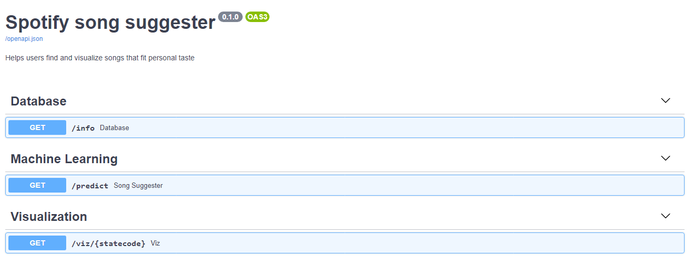
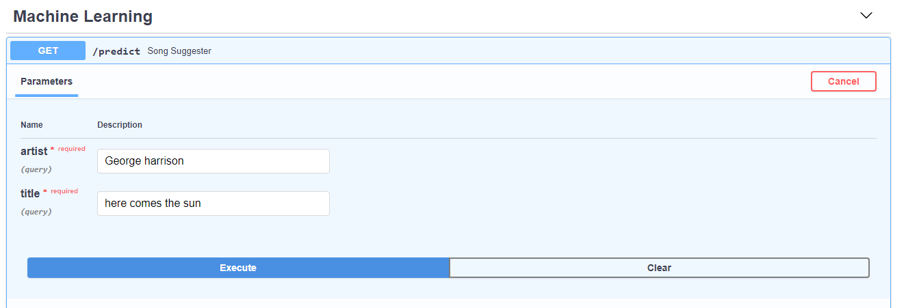
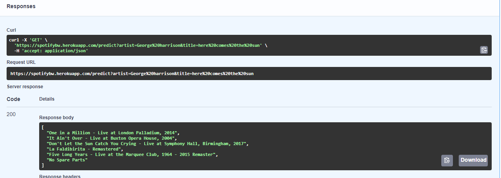

# SPOTIFY SONG SUGGESTER

The purpose of this app is to help users to find songs that fit personal taste.

# The application

Tech Stack

This application uses _python 3.8.5_ and is build using the FASTAPI framework. 
Spotipy is used in this application - needing Spotify Developer credentials - to connect to the Spotify API, 
so we can obtain songs and song features. 
In order to deploy this application to Heroku, we need the assistance of an ASGI server called Uvicorn.

How it works:

The spotify.py file makes a call to the Spotify API for a Song and Artist and renders song 
features which are put into a DataFrame. The dataframe is then used to predict the nearest neighbor
songs using a joblib file that contains a k Nearest neighbor model and dataset. The spotify file
outputs 6 recommended songs. Also you can view the data used for recommending songs.

Here is the SOng suggester URL: https://spotifybw.herokuapp.com/

To get recommendation similar to a song you love, simply click the machine learning button. Populate the Song and Artist
name by clicking the try out button and then execute.

Your songs will be populated in the response section. 

